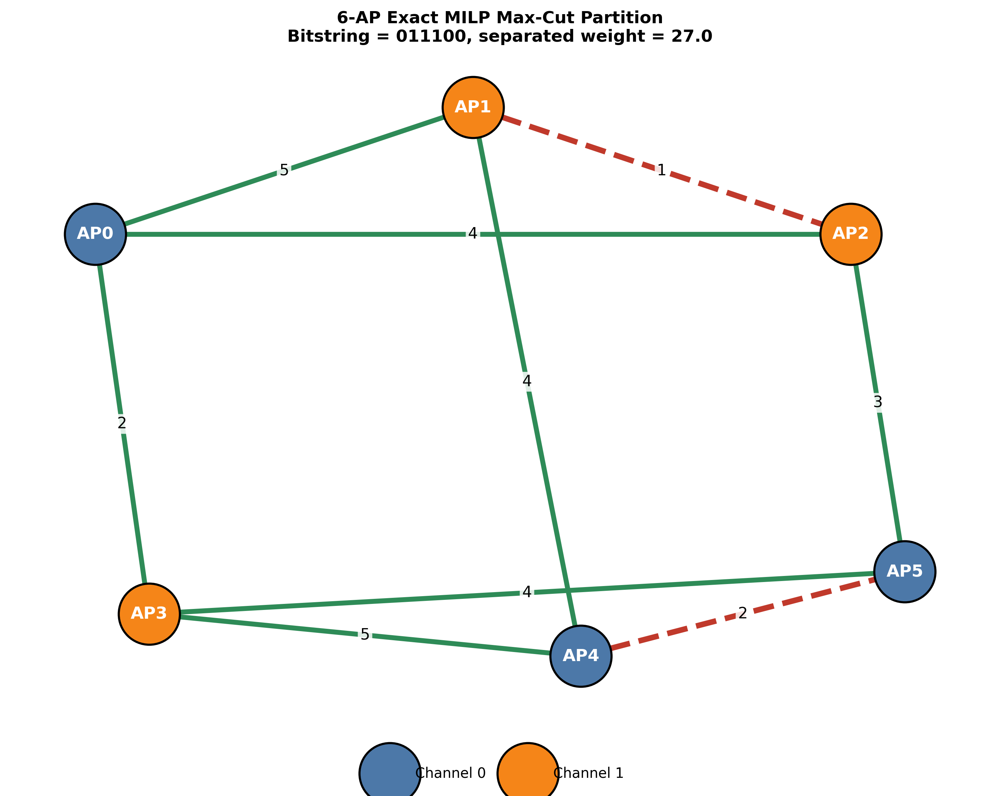
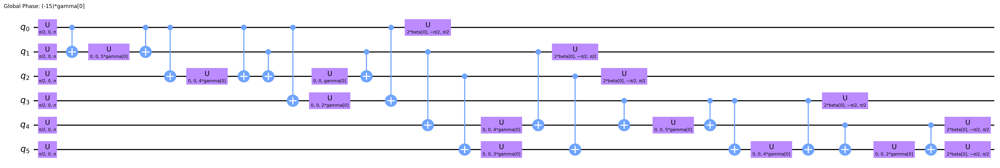

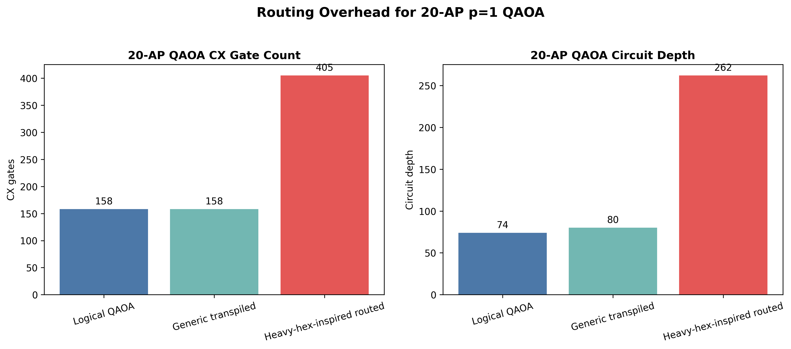

# Quantum-Assisted Wireless Channel Assignment Optimization
## MILP, Heuristic and (noisy) QAOA Benchmarking for Two-Channel Interference Management

**Author:** Praneshraj Tiruppur Nagarajan Dhyaneswar
**Date:** October 1, 2026  
**Project type:** Reproducible classical and quantum optimization benchmark

This project studies two-channel wireless access-point (AP) assignment as a
weighted MaxCut optimization problem. It compares exact classical optimization,
heuristics and Quantum Approximate Optimization Algorithm (QAOA) simulations.

It does not claim quantum advantage.

## Problem statement

Given AP positions and a symmetric interference-proxy graph, assign each AP to
one of two orthogonal channels to minimize retained same-channel interference.
Equivalently, maximize the total edge weight separated by the assignment:
a weighted MaxCut problem.

The project compares proven-optimal MILP solutions, weighted greedy local search,
simulated annealing and QAOA.

The six-node graph is an exact verification kernel. Synthetic propagation graphs
with N=10, 20, and 40 APs are used for classical scaling experiments. A
resource-limited p=1 QAOA simulation is evaluated for the 20-AP graph.

## Scope and honest limitations

- This is FFR-inspired two-channel allocation, not a complete FFR, SINR, or
  throughput model.
- AP-to-AP received power is an interference proxy; there are no UE receivers,
  traffic demands, wall models, or scheduling effects.
- The legacy 2 GHz urban-macro expression is not validated for short-range Wi-Fi.
- Shadowing is reciprocal and independent across links; it is not spatially correlated.
- Thresholding may discard low-power links whose aggregate interference could matter.
- The noise model is synthetic and is not calibrated to a specific quantum processor.
- A noisy depth inversion is an experimental hypothesis, not a required outcome.
- The heavy-hex-inspired result is a routing study, not execution on real hardware.

## Energy convention

For binary channel assignments \(x_u \in \{0,1\}\), the weighted cut value is:

\[
C(x) =
\sum_{(u,v)\in E} w_{uv}
\left[x_u + x_v - 2x_u x_v\right]
\]

The upper-triangular QUBO matrix is constructed such that:

\[
x^TQx = -C(x)
\]

The Ising energy Hamiltonian is:

\[
H_{\mathrm{energy}} =
\sum_{(u,v)\in E}
\frac{w_{uv}}{2}
\left(Z_uZ_v-I\right)
\]

For each computational-basis assignment:

\[
H_{\mathrm{energy}}(x) = -C(x)
\]

Therefore, minimizing \(H_{\mathrm{energy}}\) is equivalent to maximizing the
weighted cut.

Project bitstrings use `AP0` through `AP(N-1)`. Qiskit measurement strings are
reversed before scoring so that bit \(i\) corresponds to AP \(i\).

## Main results

### Six-AP verification benchmark

| Setting | Expected cut | Approximation ratio | Optimal-state probability | CX gates | Circuit depth |
|---|---:|---:|---:|---:|---:|
| Exact enumeration / MILP | 27.000000 | 100.00% | — | 0 | 0 |
| QAOA p=1, ideal | 20.614142 | 76.35% | 21.17% | 18 | 23 |
| QAOA p=1, noisy | 19.818848 | 73.40% | 17.70% | 18 | 23 |
| QAOA p=2, ideal | 20.805679 | 77.06% | 28.64% | 36 | 36 |
| QAOA p=2, noisy | 20.064209 | 74.31% | 20.97% | 36 | 36 |

The 6-AP graph verifies the full optimization workflow: exhaustive enumeration,
MILP, QUBO, Ising encoding, ideal QAOA, finite-shot sampling, and synthetic noise.

The selected p=2 multistart result improves on p=1 but uses twice as many CX gates.

### Classical scaling benchmark

| APs | Exact MILP cut | Greedy cut | Simulated annealing cut |
|---:|---:|---:|---:|
| 10 | 0.004349 | 0.004349 | 0.004349 |
| 20 | 0.218240 | 0.218240 | 0.218215 |
| 40 | — | 1.122507 | 1.117967 |

For 10 APs, both heuristics matched the exact MILP result. For 20 APs, greedy
local search matched the exact MILP optimum and simulated annealing reached
99.99% of that optimum. At 40 APs, greedy local search slightly outperformed
the selected simulated-annealing configuration.

### 20-AP QAOA benchmark

| Metric | Value |
|---|---:|
| Active interference edges | 79 |
| Exact MILP optimum | 0.218240 |
| p=1 statevector expected cut | 0.137535 |
| Statevector approximation ratio | 63.02% |
| Finite-shot expected cut | 0.137445 |
| Best sampled cut | 0.218215 |
| Best-sample ratio | 99.99% |
| COBYLA evaluations | 25 |
| Optimizer runtime | 17.13 seconds |
| Measurement shots | 4,096 |
| Exact-optimum sampling probability | 0.0000 |

The 20-AP QAOA experiment is intentionally resource-limited. It uses p=1, a
limited COBYLA budget, and statevector simulation. Its expected cut reaches
63.02% of the exact MILP optimum. The best measured sample is near-optimal,
but the recorded exact-optimum sampling probability is zero.

### Hardware-aware routing analysis

| Circuit | CX gates | Depth | CX overhead | Depth overhead |
|---|---:|---:|---:|---:|
| Logical QAOA | 158 | 74 | 0.00% | 0.00% |
| Generic transpiled | 158 | 80 | 0.00% | 8.11% |
| Heavy-hex-inspired routed | 405 | 262 | 156.33% | 254.05% |

Generic transpilation preserves the 158-CX logical gate count and only increases
depth from 74 to 80. Under the synthetic heavy-hex-inspired coupling map, routing
increases the circuit to 405 CX gates and depth 262. This is a topology-level
routing study, not execution on IBM hardware.

## Figures

### Exact 6-AP MILP partition



The two node colours represent the two channels. Green edges are separated by
the exact MaxCut partition; red dashed edges remain within the same channel.

### Six-AP QAOA circuits

| p=1 circuit | p=2 circuit |
|---|---|
|  |  |

### 20-AP routing overhead



## Repository structure

```text
quantum_assisted_wireless_channel_optimization/
├── notebooks/   Final reproducible Jupyter notebook
├── figures/     Exported figures used in this README
├── results/     CSV files with benchmark outputs
├── README.md
├── requirements.txt
├── .gitignore
└── LICENSE
```

## Run locally

```bash
git clone https://github.com/Jahprance/quantum_assisted_wireless_channel_optimization.git
cd quantum_assisted_wireless_channel_optimization

python -m venv .venv
source .venv/bin/activate
pip install -r requirements.txt

jupyter notebook
```

Open the final notebook from the `notebooks/` folder.

## Tech

Python · NumPy · pandas · SciPy · NetworkX · PuLP/HiGHS · Qiskit · Qiskit Aer · Matplotlib
